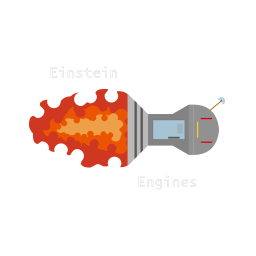

 

---

Orehum Project - представляет собой гибридный хард-форк, вобравший в себя лучшие механики и системы из множества апстримов [Space Station 14](https://github.com/space-wizards/space-station-14), построенный на идеалах и дизайнерском вдохновении семейства серверов BayStation 12 от Space Station 13 с упором на модульный код.

Orehum Project - один из серверов русского коммьюнити, который выступает за идеалы свободы отыгрыша, свободы слова и настоящей классической атмосферы Space Station 13 - хаос, веселье, возможности.

Space Station 14 - это ремейк SS13, который работает на собственном движке  [RobustToolbox](https://github.com/space-wizards/RobustToolbox), собственном игровом движке, написанном на C#.

Поскольку это хард-форк, любой код, взятый из другого апстрима, не может быть напрямую замержен сюда, а должен быть перенесен.

## Ссылки

[Orehum Project Discord Server](https://discord.gg/nUz6nH6RqW) | [Orehum Project Wiki](https://wiki.orehum-project.ru)

## Контрибуция
Мы рады любой помощи и вкладу в проект от каждого желающего. Если вы хотите помочь, заходите в наш [Discord-сервер](https://discord.gg/nUz6nH6RqW).
Хотя соблюдение [правил контрибьюта Space Station 14](https://docs.spacestation14.com/en/general-development/codebase-info/pull-request-guidelines.html) не является строго обязательным для Orehum Project, мы рекомендуем ознакомиться с ними, чтобы придерживаться лучших практик разработки.

## Сборка

Следуйте [гайду от Space Wizards](https://docs.spacestation14.com/en/general-development/setup/setting-up-a-development-environment.html) по настройке рабочей среды, но учитывайте, что наши репозитории отличаются и некоторые вещи могут отличаться.
Мы предлагаем несколько скриптов, показанных ниже, чтобы облегчить работу.

### Необходимые зависимости

> - Git
> - .NET SDK 9.0.101

### Windows

> 1. Склонируйте данный репозиторий
> 2. Запустите `git submodule update --init --recursive` в командной строке, чтобы скачать движок игры
> 3. Запускайте `Scripts/bat/buildAllDebug.bat` после любых изменений в коде проекта
> 4. Запустите `Scripts/bat/runQuickAll.bat`, чтобы запустить клиент и сервер
> 5. Подключитесь к локальному серверу и играйте

### Linux

> 1. Склонируйте данный репозиторий.
> 2. Запустите `git submodule update --init --recursive` в командной строке, чтобы скачать движок игры
> 3. Запускайте `Scripts/sh/buildAllDebug.sh` после любых изменений в коде проекта
> 4. Запустите `Scripts/sh/runQuickAll.sh`, чтобы запустить клиент и сервер
> 5. Подключитесь к локальному серверу и играйте

### MacOS

> Предположительно, также, как и на Линуксе.

## Лицензия
Весь код в данной кодовой базе распространяется под лицензией AGPL-3.0 или более поздней версии. Каждый файл содержит заголовки спецификации REUSE или отдельные файлы .license, указывающие на возможность двойного лицензирования. Двойное лицензирование предусмотрено для упрощения работы проектам, не использующим AGPL, позволяя им заимствовать соответствующие части кода под альтернативной лицензией. С полными текстами этих лицензий можно ознакомиться в директории LICENSES/.

Большинство медиа-активов (графика, звук) лицензированы под [CC-BY-SA 3.0](https://creativecommons.org/licenses/by-sa/3.0/), если не указано иное. Информация о лицензии и авторских правах на активы указана в соответствующих метафайлах. [Пример](https://github.com/space-wizards/space-station-14/blob/master/Resources/Textures/Objects/Tools/crowbar.rsi/meta.json).

Обратите внимание, что некоторые активы лицензированы под некоммерческой лицензией [CC-BY-NC-SA 3.0](https://creativecommons.org/licenses/by-nc-sa/3.0/) или аналогичными некоммерческими лицензиями. Их необходимо будет удалить, если вы планируете использовать данный проект в коммерческих целях.
